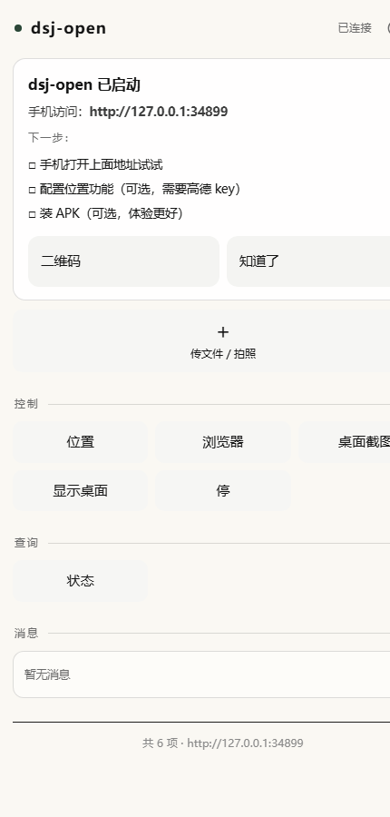
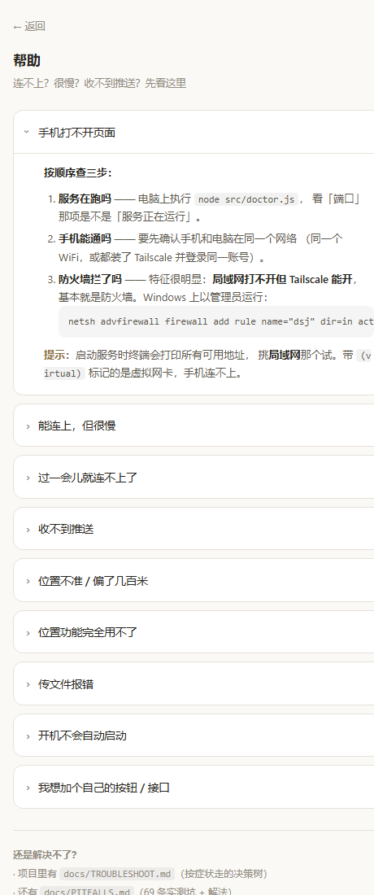

# dsj-open

**用手机访问你电脑上的服务** —— 推送、传文件、看位置、按按钮。

数据不出门，全部跑在你自己电脑上。**零 npm 依赖**。

---

## 这是什么

一个自建的服务端 + 手机客户端，让你在手机上：

- **收推送** —— 电脑上的任务完成、提醒、通知，推到手机
- **传文件** —— 手机 ↔ 电脑 双向传文件
- **看位置** —— 搜附近、看路线（需要高德 key）
- **按按钮** —— 预设动作（截图、显示桌面），**或者你自己加的命令**

**三个特点**：

| 特点 | 说明 |
|---|---|
| **同一 WiFi 下零配置** | 服务端每 3 秒广播一次，手机 App 自动发现电脑 —— **连地址都不用填** |
| **可扩展** | 加一个按钮**不用改代码**：`config.json` 里加一行就行（见 `docs/FOR-AI-EXTEND.md`） |
| **文档写给 AI 读** | `AGENTS.md` 是部署剧本，`docs/PITFALLS.md` 是 70 条实测坑 —— **出问题让你的 AI 查** |

**跟云服务不同**：所有数据留在这台电脑上，不经过任何第三方。

---

## 截图

<p align="center">
  
  
  
</p>

<p align="center"><sub>手机端首页（含上手引导） · 扫码连接（多地址选择） · 内置帮助（9 个常见问题）</sub></p>

---

## 给 AI 用的部署向导

**如果你在用 Claude / ChatGPT / Cursor 等 AI 助手帮你部署**：

> **把这个仓库里的 `AGENTS.md` 丢给你的 AI，让它带你做。**
>
> 那是一份**专门写给 AI 读的部署剧本** —— 它会一步步问你环境、判断分支、处理报错。

**这是本项目最特别的地方**：不是让你读文档，是让你**叫 AI 来读**。

---

## 快速开始（人类版）

```bash
# 1. 需要 Node.js 18+
node --version

# 2. 起服务
node src/server.js

# 3. 终端里会直接出现一个二维码 —— 手机扫一下就连上了
#    （也会打印地址，形如 http://192.168.1.100:3099/?t=<token>）
```

**启动后的终端长这样**：

```
[07:41:49] ===== dsj-open 启动，监听 0.0.0.0:3099，功能 5 个 =====
[07:41:49] 本机: http://127.0.0.1:3099/
[07:41:49] 手机访问: http://192.168.1.100:3099/

  手机扫这个（或复制上面那行）:

    █▀▀▀▀▀█ ▄█ ▄▄▄▀▄  █▀▀▀▀▀█
    █ ███ █ ▄█▀█ ▄▀ ▀ █ ███ █
    ...（二维码）

[07:41:49] 其他可用地址: 100.64.1.20(tailscale)  192.168.56.1(virtual)
```

**地址会自动挑**：局域网 IP 优先（不用装任何东西），Tailscale 次之，
虚拟网卡（VirtualBox 等）会标注出来 —— 因为**手机连不上虚拟网卡**。

**局域网内零配置**：服务端会持续发 UDP 广播（每 3 秒一次），
配套的手机 App 在同一 WiFi 下能**自动发现电脑**，连地址都不用填。
（不想要这个？`config.json` 里把 `discovery.enabled` 设为 `false`。）

**手机在外面也能访问** → 用 [Tailscale](https://tailscale.com/)（免费）。

**先自检一下环境**（可选但推荐）：

```bash
node src/doctor.js      # 或 npm run doctor
```

它会告诉你：Node 版本够不够、端口通不通、网络地址有哪些、
高德 key 配了没、缺什么、下一步做什么。

**详细步骤**：
- 给 AI：`AGENTS.md`
- 给人：`docs/ARCHITECTURE.md`
- **遇到问题**：`docs/TROUBLESHOOT.md`（按症状走决策树）
- **坑清单**：`docs/PITFALLS.md`（**70 条实测坑**）

---

## 为什么值得一看

### 1. 有一个「给 AI 的说明书」

`AGENTS.md` 不是代码风格指南 —— 是**部署剧本**。

**设计意图**：用户不需要读懂技术细节，**让用户自己的 AI 去读懂**。出了问题，用户的 AI 就地解决，不依赖作者支持。

### 2. `docs/PITFALLS.md` 是两个月踩出来的

**70 条真实坑**，每条都有**症状 → 根因 → 解法**：

- `adb tcpip 5555` vs Android「无线调试」的本质区别
- Tailscale MagicDNS 把自己当 DNS → 手机上不了网
- WGS84/GCJ02 混用偏 500 米
- `.bat` 用 LF 换行 → 整个自启链从没跑过
- 计划任务闪黑框，`-WindowStyle Hidden` 救不了
- d8 在 JDK 24 上遇到匿名内部类必崩
- …

**这些不是查文档能查到的，是踩出来的。**

### 3. Windows-only MVP

核心功能跨平台，但 `screenshot` / `show_desktop` 依赖 Win32。

---

## 架构

```
手机（浏览器 / WebView APK）
        │
        │ HTTP（局域网 或 Tailscale）
        ▼
电脑：Node 服务（零依赖）
   ├─ /api/push      推送
   ├─ /api/file      文件
   ├─ /api/poi       位置
   └─ /api/run       指令分发（白名单）
        │
        ▼
   你电脑上的东西
```

**服务端零 npm 依赖** —— 只用 Node 内置模块。

---

## 文档

| 文件 | 给谁 | 内容 |
|---|---|---|
| **`AGENTS.md`** | **AI** | **部署剧本（核心）** |
| `docs/PITFALLS.md` | 都行 | **70 条实测坑** |
| `docs/TROUBLESHOOT.md` | AI | 排障决策树（按症状走） |
| `docs/ONBOARDING.md` | 人 | 上手引导 |
| `docs/FOR-AI-EXTEND.md` | AI | 扩展指南（**含「不改代码加功能」**） |
| `docs/ARCHITECTURE.md` | 人 | 架构说明 |
| `docs/SECURITY.md` | 人 | 安全说明 |
| [`android/README.md`](android/README.md) | 人 | 安卓客户端（APK）—— 构建与配置 |
| `llms.txt` | AI 爬虫 | 索引 |

---

## 安全

- **服务只在你自己的网络里**（局域网 / Tailscale）
- **鉴权**：访问 token（首次启动自动生成）
- **指令白名单**：只能执行预设动作，不能执行任意命令
- **⚠️ 不要暴露到公网**（除非你清楚风险）

详见 `docs/SECURITY.md`。

---

## 许可

MIT

---

## 状态

**早期项目（MVP）**。核心功能可用，文档持续完善。

**如果你在使用中遇到问题** —— 先看 `docs/PITFALLS.md`，或者**把你的 AI 叫来**，让它读 `AGENTS.md`。
