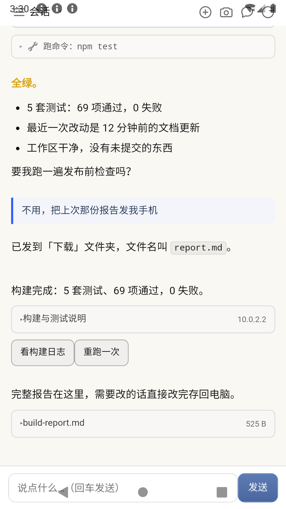
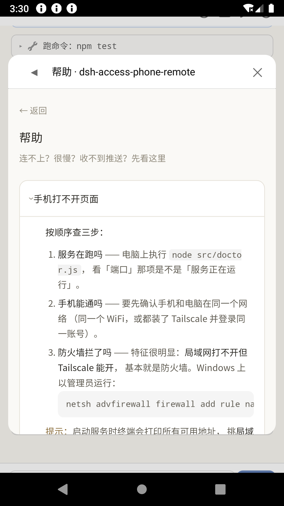
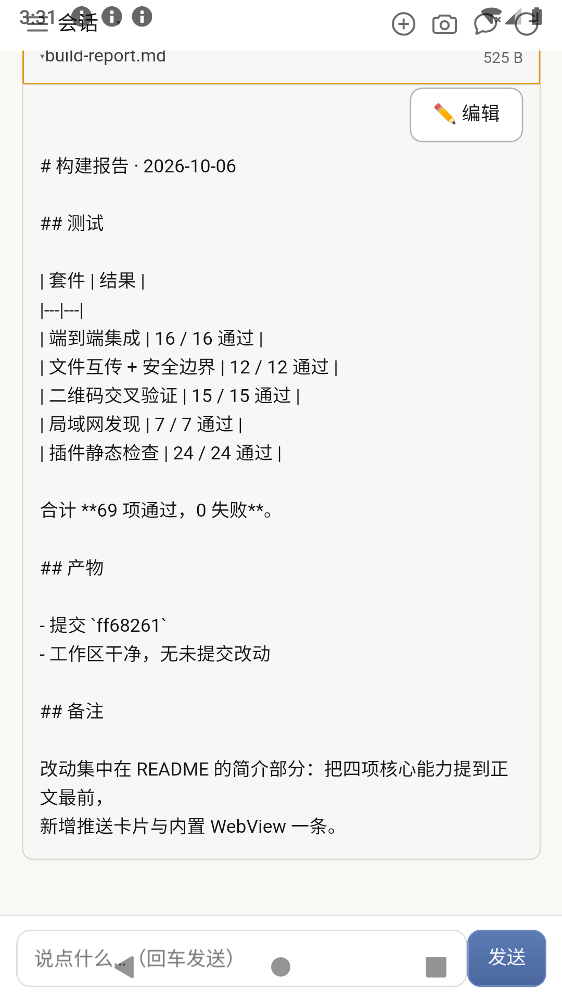
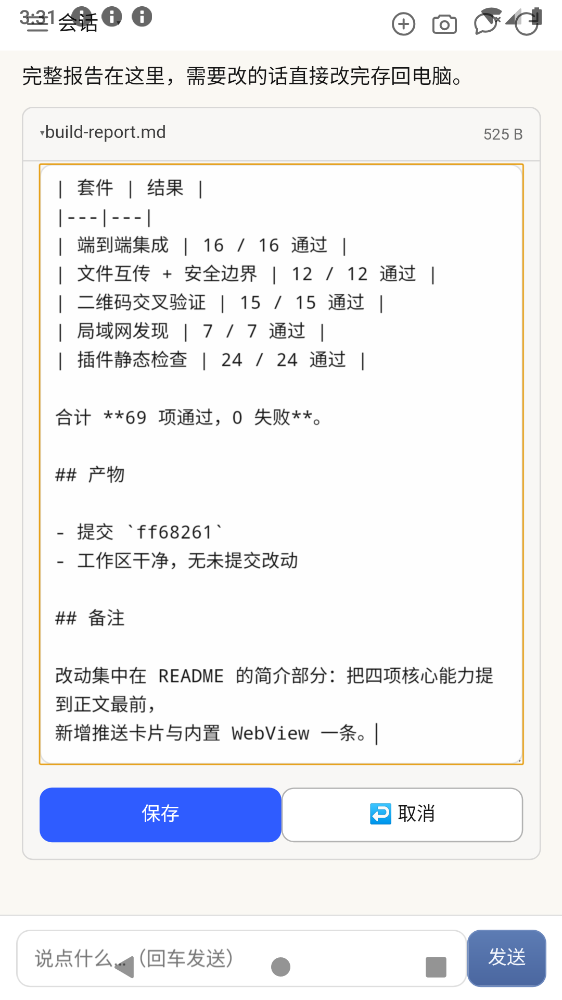

# dsh-access-phone-remote

**在手机上与你电脑上的 AI 对话，并遥控这台电脑。**

所有数据保留在本地，零 npm 依赖，仅使用 Node.js 内置模块。

---

## 简介

这个项目让手机连回自己的电脑。作者已在自己电脑上自用两个多月，2026 年 10 月开源。

其中真正构成差异的有四项能力，其余属于常规远程控制范畴，列于本节末尾。

### 一、在手机上延续电脑上的 AI 会话

电脑上运行 dsh（DeepSeek Harness）时，手机打开即接续那段对话。
**模型、会话上下文与工具全部位于电脑，手机只承担显示与输入。**

生成过程完全可见：正文逐字返回，推理内容折叠显示（标题实时标注「思考中 · N 字」），
工具调用各占一行摘要、展开后为完整参数，而不是一次性返回整段结果。

- 推理档位可在手机上直接切换（off / high / max）
- 「发送」与「停止」为两个独立按钮，生成过程中可随时中断，避免误触

> 该能力默认关闭。将 `config.json` 中的 `dsh.enabled` 改为 `true` 并配置 `dsh.base`
> 之后入口才会出现；未安装 dsh 可跳过本节，其余功能不受影响。

<p align="center">
  
</p>
<p align="center"><sub>会话页：正文逐字返回，推理与工具调用折叠在侧</sub></p>

### 二、搭便车：图片与消息在同一轮送达

手机拍摄或上传的图片不会立即发送，而是先进入待发队列；在你发送下一条消息时，
它自动附加到该消息上一并提交给 AI。

因此拍摄后直接输入文字即可，**图片与问题在同一轮送达**，无需先发送图片再补充说明。
（队列中每项保留 3 分钟，超时丢弃。）

### 三、推送是可操作的卡片，网页在内置 WebView 里打开

推送到手机的不只是一条通知。`POST /api/push` 可以携带：

- **交互按钮**（最多 6 个）：点一下把对应值作为消息回传 —— 电脑上的提问可以在手机上直接作答
- **选项卡**（最多 8 项，支持多选）：选完作为消息回传
- **网页卡片**（`{url,title}`，仅接受 http/https）：点开后进入**应用内置的独立 WebView**，
  不跳转系统浏览器。该 WebView 是独立实例而非内嵌框架，数据目录本身持久，
  因此**登录状态得以保留** —— 电脑上推来的内部页面可以直接在手机上登录并继续使用。

消息正文里的明文链接同样会自动生成一张可折叠的网页卡片，原文保持不变。

推送也可以携带**文本附件**：它折叠成一行，点开即在对话里显示全文；
右上角的「编辑」可以当场修改，保存后**写回电脑上的原文件**（写前自动备份）。

<p align="center">
  
  
</p>
<p align="center">
  
  
</p>
<p align="center"><sub>推送卡片（正文 · 网页卡 · 交互按钮） · 内置 WebView 浮层 · 文本附件展开 · 在手机上直接编辑并写回</sub></p>

### 四、无需配置 IP 与端口

服务端每 3 秒在局域网内广播一次，手机客户端自动发现电脑，无需手动填写地址。
需要外网访问时使用 [Tailscale](https://tailscale.com/)，两端登录同一账号即可回连，
不需要公网 IP，也不需要端口映射。

### 其余能力

任务完成与提醒的通知推送、双向文件传输、周边搜索与路线规划、一键截图与显示桌面，
以及自定义指令（修改 `config.json` 即可新增按钮，无需改动代码）。

<p align="center">
  
  
</p>
<p align="center"><sub>主页抽屉（传文件 · 位置 · 截图 · 自定义按钮） · 内置帮助页</sub></p>

**与云服务的区别**：所有数据保留在本地电脑，不经过任何第三方。

---

## 下载

| 你要什么 | 拿哪个 | 必需吗 |
|---|---|---|
| **服务端** | 本仓库 clone 下来，`node src/server.js`。零 npm 依赖 | **必需** |
| **Android 客户端** | [Releases](https://github.com/hanzheng-dev/dsh-access-phone-remote/releases/latest) 里的 APK（约 50 KB，Android 7+） | 可选 |
| **dsh 插件** | `dsh plugin --profile web add github:hanzheng-dev/dsh-access-phone-remote#path:/plugin`，或 npm 的 `dsh-access-phone-remote` | 可选 |

**不装 APK 也能用** —— 手机浏览器打开服务端地址即可，功能一致；装 APK 才有的额外好处是系统通知推送。

---

## 给 AI 用的部署向导

**如果你在使用 Claude / ChatGPT / Cursor 等 AI 助手协助部署**：

> **将本仓库的 `AGENTS.md` 提供给该助手，由它引导你完成部署。**
>
> 它是一份**专为 AI 阅读而写的部署剧本**，会逐步确认环境、判断分支、处理报错。

这是本项目区别于同类工具的一点：部署知识不以「让人读懂」为目标，
而是**交给使用者自己的 AI 读懂**。

---

## 快速开始

```bash
# 1. 需要 Node.js 18+
node --version

# 2. 起服务
node src/server.js

# 3. 终端里会直接出现一个二维码 —— 手机扫一下就连上了
#    （也会打印地址，形如 http://192.168.1.100:3099/?t=<token>）
```

**启动后的终端长这样**：

```
[07:41:49] ===== dsh-access-phone-remote 启动，监听 0.0.0.0:3099，功能 5 个 =====
[07:41:49] 本机: http://127.0.0.1:3099/
[07:41:49] 手机访问: http://192.168.1.100:3099/

  手机扫这个（或复制上面那行）:

    █▀▀▀▀▀█ ▄█ ▄▄▄▀▄  █▀▀▀▀▀█
    █ ███ █ ▄█▀█ ▄▀ ▀ █ ███ █
    ...（二维码）

[07:41:49] 其他可用地址: 100.64.1.20(tailscale)  192.168.56.1(virtual)
```

**地址会自动挑**：局域网 IP 优先（不用装任何东西），Tailscale 次之，
虚拟网卡（VirtualBox 等）会标注出来 —— 因为**手机连不上虚拟网卡**。

**局域网内零配置**：服务端会持续发 UDP 广播（每 3 秒一次），
配套的手机 App 在同一 WiFi 下能**自动发现电脑**，连地址都不用填。
（不想要这个？`config.json` 里把 `discovery.enabled` 设为 `false`。）

**手机在外面也能访问** → 用 [Tailscale](https://tailscale.com/)（免费）。

**先自检一下环境**（可选但推荐）：

```bash
node src/doctor.js      # 或 npm run doctor
```

它会告诉你：Node 版本够不够、端口通不通、网络地址有哪些、
高德 key 配了没、缺什么、下一步做什么。

**详细步骤**：
- 给 AI：`AGENTS.md`
- 给人：`docs/ARCHITECTURE.md`
- **遇到问题**：`docs/TROUBLESHOOT.md`（按症状走决策树）
- **坑清单**：`docs/PITFALLS.md`（**83 条实测坑**）

---

## 为什么值得一看

### 1. 有一个「给 AI 的说明书」

`AGENTS.md` 不是代码风格指南 —— 是**部署剧本**。

**设计意图**：用户不需要读懂技术细节，**让用户自己的 AI 去读懂**。出了问题，用户的 AI 就地解决，不依赖作者支持。

### 2. `docs/PITFALLS.md` 是两个月踩出来的

**83 条真实坑**，每条都有**症状 → 根因 → 解法**：

- `adb tcpip 5555` vs Android「无线调试」的本质区别
- Tailscale MagicDNS 把自己当 DNS → 手机上不了网
- WGS84/GCJ02 混用偏 500 米
- `.bat` 用 LF 换行 → 整个自启链从没跑过
- 计划任务闪黑框，`-WindowStyle Hidden` 救不了
- d8 在 JDK 24 上遇到匿名内部类必崩
- …

**这些不是查文档能查到的，是踩出来的。**

### 3. Windows-only MVP

核心功能跨平台，但 `screenshot` / `show_desktop` 依赖 Win32。

---

## 架构

```
手机（浏览器 / WebView APK）
        │
        │ HTTP（局域网 或 Tailscale）
        ▼
电脑：Node 服务（零依赖）
   ├─ /api/chat  /api/sessions  /api/busy
   │  /api/delta /api/stop      /api/effort   会话页：跟电脑里的 AI 接着聊
   ├─ /api/push  /api/inbox     /api/events   推送（含 SSE 实时流）
   ├─ /api/file  /api/upload                  文件读 / 下载 / 写回 / 上传
   ├─ /api/loc   /api/poi       /api/route    定位 / 附近搜索 / 路径规划
   ├─ /api/run  /api/commands                 指令分发（白名单）
   └─ /api/addresses /api/features /api/ping  地址列举 / 功能开关 / 健康检查
        │
        ├──────────────► 你电脑上的 dsh（DeepSeek Harness）  ← 会话页注入这条
        │
        └──────────────► 你电脑上的其它东西（截图 / 文件 / 桌面）
```

**服务端零 npm 依赖** —— 只用 Node 内置模块。

---

## 文档

| 文件 | 给谁 | 内容 |
|---|---|---|
| **`AGENTS.md`** | **AI** | **部署剧本（核心）** |
| `docs/PITFALLS.md` | 都行 | **83 条实测坑** |
| `docs/TROUBLESHOOT.md` | AI | 排障决策树（按症状走） |
| `docs/ONBOARDING.md` | 人 | 上手引导 |
| `docs/FOR-AI-EXTEND.md` | AI | 扩展指南（**含「不改代码加功能」**） |
| `docs/ARCHITECTURE.md` | 人 | 架构说明 |
| `docs/SECURITY.md` | 人 | 安全说明 |
| [`android/README.md`](android/README.md) | 人 | 安卓客户端（APK）—— 构建与配置 |
| `llms.txt` | AI 爬虫 | 索引 |

---

## 安全

- **服务只在你自己的网络里**（局域网 / Tailscale）
- **鉴权**：访问 token（首次启动自动生成）
- **指令白名单**：只能执行预设动作，不能执行任意命令
- **⚠️ 不要暴露到公网**（除非你清楚风险）

详见 `docs/SECURITY.md`。

---

## 许可

MIT

---

## 状态

**早期项目（MVP）**。核心功能可用，文档持续完善。

**遇到问题时**：先查 `docs/PITFALLS.md`；或将其与 `AGENTS.md` 一并交给你的 AI 助手处理。
