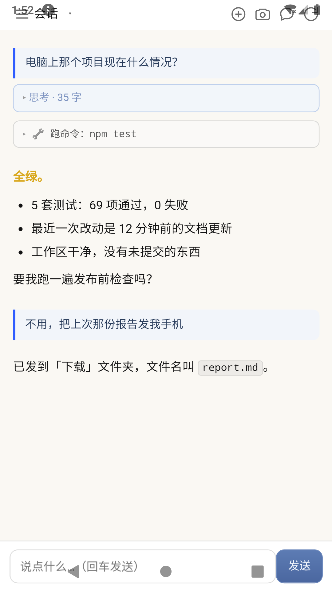

# dsh-access-phone-remote（dsh 插件）

**在手机上跟你电脑里的 AI 对话，顺便遥控这台电脑。**

这个目录是 [dsh-access-phone-remote](https://github.com/hanzheng-dev/dsh-access-phone-remote)
的 **dsh 插件半** —— 它负责在 harness 里**托管服务端**：启动 / 停止 / 重启、
健康检查、日志尾部，并在**设置页**给你一页「手机远程」：改目录和端口、
显示手机访问地址、**当场生成二维码让你用手机扫**。

服务端本体（手机网页 / SSE / 文件传输 / 位置）在那个仓库里，
**零 npm 依赖**，不属于 dsh 也能单独跑。

---

## 装

```sh
dsh plugin --profile web add github:hanzheng-dev/dsh-access-phone-remote#path:/plugin
```

`#path:/plugin` 是必须的 —— 插件在 monorepo 的子目录里，
不写这个装到的是仓库根（那是个独立的 Node 应用，不是插件）。

## 用

1. 把服务端仓库克隆到本地：

   ```sh
   git clone https://github.com/hanzheng-dev/dsh-access-phone-remote D:\dsh-access-phone-remote
   ```

2. 打开 dsh 的 **设置 → 手机远程**：
   - **项目目录** 填上一步的路径，例如 `D:\dsh-access-phone-remote`
   - 端口默认 `3099`（服务端默认值也是 3099，改一边两边都要改）
   - 点 **保存配置**
3. 点 **启动服务**。状态会变成「服务运行中」。
4. 面板会显示**手机访问地址**和**二维码**：

   ```
   http://192.168.1.100:3099/?t=xxxxx
   ```

   **手机浏览器打开它，或者直接扫码。**
5. 出门在外也能用？装 [Tailscale](https://tailscale.com/)（免费），
   电脑和手机登同一账号 —— 面板里的地址会自动优先选 Tailscale IP。

---

## 面板里有什么

| 功能 | 说明 |
|---|---|
| **看状态** | 服务在跑吗、PID、运行时长、项目目录、端口（3 秒轮询一次） |
| **启动 / 停止 / 重启** | 按当前状态只显示能用的那个 |
| **手机访问地址** | 优先 Tailscale IP，其次局域网，带 token |
| **二维码** | **本地生成**，不调任何外部图床（地址里含 token，发出去就等于泄露） |
| **配置** | 项目目录、端口 |
| **复制诊断信息** | 一键生成一段报告，粘贴给你的 AI 让它帮你排查 |

<p align="center">
  
  
</p>

上图是服务端在手机上的样子 —— 插件把它接起来之后你能拿到的东西。

---

## 插件暴露的本机接口

全部走 dsh 的 `webServer`，只在**回环地址**上，前缀 `/api/dsh-access-phone-remote`：

| 方法 | 路径 | 用途 |
|---|---|---|
| GET | `/status` | 服务状态（HTTP ping 探测，不依赖插件记的进程） |
| POST | `/start` | 启动服务（spawn `src/server.js`） |
| POST | `/stop` | 停止服务 |
| POST | `/restart` | 重启（停止 → 等 800ms → 启动） |
| GET | `/config` | 读插件配置 |
| POST | `/config` | 写插件配置（merge 语义） |
| GET | `/url` | 手机访问地址 + 二维码内容 |
| GET | `/log` | 内存里最近 200 行日志 |
| GET | `/diagnose` | 一段可直接复制给 AI 的诊断文本 |

非 GET 请求要求自定义头 `x-dsh-plugin: dsh-access-phone-remote`
（自定义头跨域必触发预检，而本服务不答 CORS 预检，这是最低限度的 CSRF 防线）。

配置存在 `<DSH_HOME>/dsh-access-phone-remote/plugin.json`。

---

## 服务端那边有什么

| 接口 | 用途 |
|---|---|
| `/api/push` · `/api/inbox` · `/api/events` | 推送到手机 / 拉取 / SSE 实时流 |
| `/api/file` · `/api/upload` | 文件下载 / 上传 |
| `/api/chat` · `/api/sessions` · `/api/delta` | **会话页 —— 在手机上接着电脑里的 AI 聊** |
| `/api/poi` · `/api/route` | 搜附近 / 路线规划（需要高德 key） |
| `/api/run` | 执行预设动作（白名单） |

---

## 三个最容易踩的坑

**这三个会让你以为「坏了」，其实只是配置问题。**

### 坑 1：Tailscale 抢了 DNS → 手机上不了网

**症状**：手机能 ping 通 IP，但打不开任何**域名**。

**解法**：Tailscale 应用里关掉 **Use Tailscale DNS**。
（手机的 DNS 被设成 `100.100.100.100`，而它的上游又是「系统默认」→ 死循环。）

### 坑 2：位置偏 500 米

手机 GPS 给的是 **WGS84**，国内地图用 **GCJ02**（火星坐标），直接混用差 500 米。
**服务端已经处理了** —— 但改代码时务必注意。

### 坑 3：`.bat` 用 LF 换行 → 开机自启静默失效

Windows 的 `.bat` 必须是 **CRLF**。LF 会让 `cmd.exe` 解析错乱。

**完整的坑清单（83 条，症状 → 根因 → 解法）在服务端仓库的
[`docs/PITFALLS.md`](https://github.com/hanzheng-dev/dsh-access-phone-remote/blob/main/docs/PITFALLS.md)。**

---

## 安全性

- 服务只在**你自己的网络**里（局域网 / Tailscale），**不要暴露到公网**
- **Token 鉴权**（首次启动自动生成 24 字节，写在 `<root>/.hub-token`）
- 指令**白名单** —— 只能执行预设动作，**不能执行任意命令**
- 文件路径白名单 + 防路径穿越
- 二维码本地生成 —— 地址带 token，不发往任何第三方

---

## 许可

MIT
